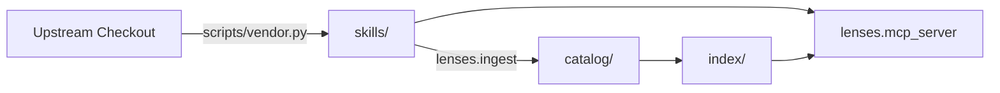

# superpowers-using-lenses


Agent skills are written whole and loaded whole. That is fine for a 200-line
lens and wasteful for a UI library's manual, where a slice about grids and
buttons needs two sections out of forty.

This cuts skills into **parts** — stretches usable on their own — and serves
them to an agent over MCP, so an architect designing a milestone, a slice spec
or a plan can find the two that bear on it and cite them, instead of pulling
whole skills into context.

Currently **41 skills · 405 parts** from four upstreams.

## The pipeline



Each stage writes what the next one reads, and each artefact says where it came
from. Nothing downstream ever reaches back to an upstream checkout.

## Two invariants

**The model marks up. It never writes.** Decomposition returns *line ranges*
and metadata; part text is then cut from the file by those ranges. What reaches
any downstream agent is verbatim upstream text. The model's only original
output is `title` and `applies_to`, which are metadata nobody executes.

This is structural rather than a rule to remember: there is no code path by
which generated prose becomes an instruction. It also settles the licence
question — this redistributes quotations with provenance — and it is why a
cheap decomposition model is a deliberate choice rather than a corner cut.

**The catalogue is source; the index is derived.** `skills/` and `catalog/`
live in git and are reviewable as diffs. `index/` is rebuilt from the catalogue
on every run and is gitignored. That direction is what lets a citation survive
a rebuild, and lets a contributor propose a change as a pull request rather
than as a row in somebody's database.

## Where the idea came from

[SkillLens](https://arxiv.org/abs/2605.08386) named the tension this is built
around — a library serving whole, single-resolution skills forces a choice
between relevance and cost — and answered it with mixed granularity: skills as
a four-layer graph of policies, strategies, procedures and primitives,
retrieved at whatever resolution the task needs. Cutting skills into parts and
ranking those rather than their parents is that idea, taken directly. What is
deliberately not taken is the other half: its verifier decides per unit whether
to accept, decompose, **rewrite** or skip, and rewriting is what the invariant
above forbids — a part arrives as its upstream author wrote it, or it does not
arrive. Its graph is also where this is thinnest: `requires` is the whole of
that mechanism here, and 6.4% of the catalogue writes it.

## Two ways in

Which one applies is decided by the skill's own shape, not by a flag.

| | **Decompose** | **Import** |
|---|---|---|
| When | `SKILL.md` *is* the content | `rules/` holds the content, `SKILL.md` is a contents page |
| Boundaries drawn by | a model, as line ranges | the upstream author, as files |
| `applies_to` from | the model | the file's own frontmatter |
| Cost | one paid call per skill | **zero** |
| Determinism | re-running moves part ids | byte-stable |

Import exists because some upstreams ship one rule per file. Decomposing those
would cut up a contents page, lose every rule, and charge for it. Of the 405
parts here, **108 arrived free** this way.

## What a part carries

```yaml
- id: circuit-breaker
  title: Circuit breaker
  applies_to: Use when a slice calls a dependency that can be slow or down.
  kind: lens                    # lens · reference · pipeline
  preamble_spans: [[3, 14]]     # parent context, quoted — without it the part misleads
  spans: [[128, 171]]           # the part itself
  requires: [timeouts]          # siblings that must travel with it
  tags: [resilience, timeouts]  # author's keywords, when the upstream gives them
  file: rules/circuit.md        # imported parts only; absent means spans cut SKILL.md
  sha256: a71c…                 # of preamble+text — the pin a citation carries
```

`preamble_spans` exists because a section torn from its definitions is not
merely incomplete, it can be actively wrong. `sha256` exists because a citation
by name alone starts meaning something else the day upstream is rewritten.

`requires` is the case a preamble cannot carry: not a heading but a whole
sibling section. `get_lenses` follows it — the full closure, not one hop — so a
part whose decomposition recorded that it cannot stand alone never arrives
alone. The extra parts come back in the same `parts` list, each naming what
pulled it in:

```json
{"ref": "…#configuration@…", "required_by": ["…#app-factory-lifespan@…"]}
```

A part you asked for has an empty `required_by`. Cite what you chose, not what
came with it. Nothing is dropped in silence: a requirement that will not
resolve, and a closure that outgrows the ceiling of 12 parts per reference,
are both named in `errors` while everything that did resolve is still returned.
`find_lenses` reports `requires` and does not follow it — a candidate is
something you are still deciding about, and expanding it there would spend your
`limit` on parts you never chose.

Measured over the catalogue as committed: 76 edges across 26 parts in 11 of 41
skills, no cycles at any length, widest closure 7 (at
`wondelai/pragmatic-programmer#common-pragmatic-mistakes`). The visited set is
not decoration — `decompose` rejects unknown ids and self-reference but not
`a → b → a`, so that zero is an observation about one model's output rather
than a property of the format.

## Setup

```bash
python -m venv .venv
.venv/Scripts/python -m pip install -e ".[dev]"
cp .env.example .env
```

Two OpenAI-compatible endpoints: a chat model for decomposition, an embedding
model for the index. They can be one server. `embedder_dim` is the vector
width, not the model's context length — `bge-base-en-v1.5` is 768 wide with a
512-token window, and the two are easy to confuse. It is asserted twice: against
the vectors the server returns, and against the index already on disk. Both
matter, because a query and an index built by different models score against
each other silently and answer with confident nonsense. Changing the embedder
means rebuilding the index — the catalogue is unaffected, being the model's
work rather than the embedder's.

A third model can narrow the 20 dense candidates to the answer. Whether it runs
is not a setting — it is whether you configured an endpoint for it:

| | no second pass | the listwise pass |
|---|---|---|
| Sees | — | the whole numbered pool of 20 |
| Configuration | leave the three `reranker_*` settings out | set all three |
| Need-only phrasing | **33/34** | 32/34 |
| **Project phrasing** | 27/34 | **33/34** |
| **Total** | 60/68 | **65/68** |
| Cost | 0 | 2.3 s/query on `gemma-4-e4b-it-qat` |

That cost line said `0.23 s/query` until 2026-08-03 and it was wrong three
ways. It counted only the ranking call; it was inherited from an earlier
session and never re-taken; and the thing it appeared to measure is not the
model at all.

**It was `localhost`.** Every request to the local endpoint cost a flat ~2.1 s
that had nothing to do with inference: a three-token prompt to a 2B, the same
prompt to a 4B, and embedding the single word *hello* on a 110M encoder all
landed within 0.1 s of each other. On Windows `localhost` resolves to `::1`
first, and if the server listens on IPv4 only, each request pays a refused
connection and a retry before any work starts.

| endpoint written as | one call |
|---|---|
| `http://localhost:1234/v1` | 2.15 s |
| `http://127.0.0.1:1234/v1` | **0.11 s** |

A whole `find_lenses` went from **4.4 s to 0.47 s** on that one change, and
`.env.example` now ships the IPv4 literal with the reason beside it.

Two things are worth keeping from how long it hid. It is perfectly disguised
as a slow model — it scales with nothing, so every comparison between models
stayed valid while every absolute number was ten times too large — and it
survived a model upgrade and a plan to split ranking and classification across
two models to save latency. That plan was built, measured, and gained nothing;
`classifier_model` is what remains of it, and it ships unset.

What is left is real: ~0.11 s per round-trip, two of them per search, with the
coverage classification overlapped so it adds ~0.02 s rather than its own call.
Reusing one HTTP client instead of opening a connection per request measured
**no** further gain against a local IPv4 endpoint, so it is not done; against a
hosted endpoint paying a TLS handshake each time it would be a different
answer.

Measured 2026-08-03 on 34 paired needs. The ceiling is 67/68 — what the pool of
20 contains before anything reorders it — so this is being graded on how much
of an answer it throws away, and it now throws away two.

There is no `reranker_kind` and no default to get wrong. The three settings are
read together or not at all: setting one of them raises at load rather than
searching without the pass you asked for, and a configured endpoint is probed
once at startup, so a wrong URL is a server that does not start rather than one
answering five points worse than it says. If the endpoint fails *later*, the
dense ordering answers, `ranked_by` says `"dense"`, and a `warning` says why.

Running without it is supported and costs five cases. The endpoint is
deliberately separate from `llm_base_url` — that model decomposes skills once
each, this one runs on every search and wants to be local.

Pointing `embedder_model` at a reranker is a trap worth naming — the server
answers 200 with plausible-looking vectors, every dimension guard passes, and
retrieval quietly gets worse.

`sources.yaml` says which upstreams to vendor from and which of their skills to
take; `sources_root` in `.env` keeps the machine-specific part out of it.

## Commands

```bash
python scripts/vendor.py                     # upstream -> skills/
python scripts/vendor.py --check             # re-hash the corpus, report drift
python -m lenses.ingest --dry-run            # what would run, and in which mode
python -m lenses.ingest                      # skills/ -> catalog/ + index/
```

| Flag | |
|---|---|
| `--only LABEL` / `--skill NAME` | narrow to one upstream or one skill (glob) |
| `--dry-run` | list the plan; **calls nothing**, so it is safe as a cost check |
| `--force` | re-decompose what is already catalogued |
| `--limit N` / `--yes` | cap a run; `--yes` is required above 25 paid skills |
| `--no-embed` | catalogue only, skip the index |

A catalogue file is keyed by its source's content hash, so a second run over
unchanged skills does nothing. Not only a speed trick: decomposition is
non-deterministic, and re-deriving parts nobody asked to change would move
every part id and break every citation pinned to them.

## Serving it: MCP

```json
{
  "mcpServers": {
    "using-lenses": {
      "command": "<repo>/.venv/Scripts/python.exe",
      "args": ["-m", "lenses.mcp_server"],
      "env": { "LENSES_HOME": "<repo>" }
    }
  }
}
```

| Tool | |
|---|---|
| `find_lenses(intent, limit, kind, stack)` | ranked parts for a stated need |
| `get_lenses(refs)` | the text those references name, verified against its pin |
| `list_skills()` | what the corpus holds, before concluding it holds nothing |

State the **need**, not the solution, and strip the project it came from.
*"an external call in the request path can hang or be down and must not take
the whole service with it"* returns the right part first. Parts are indexed by
*when they apply*, so proper nouns — `Stripe`, `checkout`, the feature name —
pull the query toward parts that merely share their vocabulary.

How much that costs depends on whether the second pass is configured: it reads
past project vocabulary almost completely (33/34), the dense ordering alone
much less (27/34). The need-only habit is worth keeping because it is the form
that works under either. `ranked_by` in each response says which one answered.

Three operational facts. The index is read **once at startup** — rebuild the
corpus and the running server will not notice, so restart the client. The
embedding endpoint is not optional: without it `find_lenses` returns a readable
error rather than silence. The ranking endpoint is: if it stops answering, you
get the dense results, `ranked_by: "dense"` and a `warning`, never nothing.

## Citing a part

`find_lenses` returns references shaped like:

```
wondelai/release-it#stability-anti-patterns@34ac73394a51
```

Put those in a document's `lenses:` frontmatter. The trailing version is the
point — it pins the text, so the citation cannot come to mean something else
later. A session opening that document resolves them with `get_lenses`.

## Gates

Nothing is written that fails these. All mechanical, all offline.

*Decomposed:* spans inside the file, ordered, non-overlapping; coverage above
`min_coverage`, with the unclaimed line ranges printed; no single part larger
than both 100 lines and 35% of the document — that is the document, not a part
of it; `requires` resolving inside the same skill; ids unique and kebab-case.

*Imported:* every part names a file that exists and is non-empty, with an
`applies_to`. Coverage and overlap do not apply — those exist to catch a model
cutting one document badly, and here there was no cutting.

*Corpus:* `vendor.py --check` re-hashes every vendored byte, and `get_lenses`
re-checks a part's own hash before returning it. An edited quotation is refused
rather than served.

## What is not settled

Honest status, because the numbers are thin.

**`requires` is wired, but only 6.4% of the corpus writes it.** 26 parts of 405
carry the field, so following it changes what an agent receives for those 26
and nothing else. Half the corpus — 204 parts — carries neither `requires` nor
`preamble_spans`, which is to say nothing travels with it at all. Raising that
is a decompose-prompt change plus a paid re-ingest of every skill, and it is
worth paying for only now that something reads the result: `decompose.py` gives
`requires` one line where `kind` and `applies_to` each get a paragraph, which
is the likeliest reason for the 6.4%.

**A closure hands you the preamble once per part.** When siblings share a
`preamble_spans` prefix — 23 of the 26 closures do — each arrives carrying its
own copy, because each part's text is what its `sha256` covers. Across the
whole catalogue that is 23 236 duplicated characters of 231 413 returned: 10%,
rising to 24% on the worst closure. It is not deduplicated on purpose. Trimming
the repeat would return text that no longer matches the recorded hash, and a
citation that resolves to different text is the failure this design exists to
prevent. Ten percent buys every part in the answer being verifiable on its own.

**Nothing rejects a cycle at ingest.** `decompose` refuses unknown part ids and
self-reference, and stops there. Resolution carries a visited set so a cycle
terminates at runtime, but the catalogue would happily record one and no
validation would say so.

**The phrasing gap is mostly closed, and how it closed is the lesson.**
`scripts/eval_retrieval.py` runs each need in two registers: the need alone,
and the same need carrying a real project's proper nouns. Only the second
occurs in production. The three paragraphs that follow are how that was first
measured, at seventeen pairs — kept because the reasoning still holds and the
numbers no longer do. With a cross-encoder second pass those scored 16/17 and
14/17; with the `llm` pass, **16/17 and 16/17**.

Every score in these three paragraphs is out of **34 needs — 17 pairs across
two axes**, not out of the 34 *cases* the eval carries today. The
denominators collide and the older ones are the smaller measurement.

Two stronger cross-encoders were tried first and both lost — `bge-reranker-base`
25, `bge-reranker-v2-m3` 29, against MiniLM's 30. The fix was never a bigger
model of the same shape. A cross-encoder scores a (query, passage) pair and can
only ever answer how alike two strings are; it cannot know that *"keeping a
Stripe call from hanging"* is a resilience need, because `applies_to` is
written in the register of moments and the query carries a project's nouns. A
larger cross-encoder is a better answer to the wrong question. An
instruction-tuned model reads past it.

The shape mattered more than the model, and this is the number to remember.
Asked to score candidates one at a time with a digit, the same gemma scored
**23**; shown all twenty at once and asked which six are best, **32**. Small
models have no stable absolute scale — *"is this a 7 or an 8?"* — but
comparison inside a visible set needs no scale. Changing the question was
worth +9. No change of model ever came close.

**What the retirement of `bge-reranker-v2-m3` does not rest on is a solid
margin.** One case separated it from MiniLM, at half today's sample, and both
were later beaten by a listwise pass that made the comparison moot. Twice
since, a conclusion drawn at 17 pairs inverted at 34 — the cross-encoder went
from defensible default to below having no second pass at all. The reasoning
that retired it still holds, because it is about shape rather than score; the
number that accompanied it was one case wide, and slice 02 deleted the code
that could re-take it.

**The search now says when the catalogue does not cover the need — and the
score never could.** All 34 eval cases have a right answer in the catalogue,
so the suite could not see the failure that matters most to a calling agent:
six plausible results for a need this catalogue knows nothing about, cited
into a `lenses:` block because the response looked identical either way.

`catalog/taxonomy.yaml` holds nineteen subject areas, derived from the corpus
so that they cover it by construction, each carrying what it does *not* cover.
Every search classifies the need against them. `subject` names the shelf that
was searched; when none fits, a `warning` says so and **the results still come
back**. Reported, never filtered — the model behind the label is the same one
that showed a register bias above, and filtering on its judgement would trade
a visible wrong label for an invisible missing answer.

Measured on seventeen probes in the register that occurs in production, all
carrying project proper nouns: **9/9** software needs labelled correctly,
**8/8** non-software needs abstained. The strongest of those is a restaurant
service bottleneck, phrased in queueing vocabulary throughout.

The mechanism is the wording, not the model. Bare labels sent four of five
uncovered needs to a plausible category; the same labels carrying scope and
exclusions sent five of five to NONE. Upgrading the model from `e2b` to `e4b`
was worth +2 on that set; writing the exclusions was worth +4.

`scripts/eval_retrieval.py` now carries twelve of these as `UNCOVERED` cases,
in both registers, so the signal is regression-tested rather than probed.
Measured across all of them:

| | |
|---|---|
| covered needs that kept a subject | **68/68** — no false abstentions |
| uncovered needs abstained, caller's phrasing | **12/12** |
| uncovered needs abstained, need-only phrasing | **6/12** |

**The two registers swap places here**, which nothing else in this project
does. Proper nouns carry the domain: *"our restaurant's dinner service is
bottlenecking on the pass"* is plainly not software, while the same need
stripped to *"work piles up at one station while everything upstream keeps
arriving"* describes a queue in a system, and a subject area is not a stupid
answer to it.

So the guidance `find_lenses` gives its caller — state the need without the
project, because that is what ranking wants — is the same act that costs the
coverage signal its domain. That tension is real and unresolved; it is here so
it is not met later as a surprise.

Only false abstentions gate the eval. A missed abstention leaves the caller
exactly where they were before this existed; a false one puts a warning on a
good answer and teaches them to stop reading warnings, which costs the
mechanism itself.

Probed by hand — five needs deliberately outside a catalogue of design,
product and engineering lenses, against two known hits:

| need | in the corpus | top `dense_score` |
|---|---|---|
| a milling toolpath that avoids chatter | no | 0.525 |
| a dosing schedule for a phase II trial | no | 0.531 |
| a break clause in an office lease | no | 0.476 |
| JVM garbage-collection pause tuning | no | **0.563** |
| Kubernetes pod autoscaling | no | **0.590** |
| an external call that can hang | **yes** | **0.561** |
| where business rules should live | yes | 0.610 |

**The ranges overlap, so no threshold separates them.** JVM tuning, absent
from the corpus entirely, outscores a genuine hit on `release-it`. The spread
inside the six does not rescue it either — 0.042–0.074 for the absent needs
against 0.040–0.112 for the present ones, the real hit being the flattest of
all. The milling question comes back led by `ux-heuristics#heuristic-conflicts`.

Five probes and two controls is not a distribution, and the honest reading is
narrow: it is enough to show that one threshold cannot work, not enough to
characterise how often this bites. What follows for a caller is unchanged
either way — `list_skills()` first, and treat a `lenses:` citation as a claim
about a catalogue whose edges nothing currently reports.

**Those numbers came from 17 pairs, and 34 told a different story.** The eval
now runs 34, chosen to reach the 23 skills of 41 that no earlier expectation
could reach and to ask, for a third of them, whether a stack-tagged part
surfaces from prose that never names the stack. It paid immediately, and
against the second pass rather than the corpus.

**The cross-encoder was retired on 2026-08-03 at a final 57/68**, against 60/68
for having no second pass at all: it gave up three cases on need-only phrasing
and gained none on project phrasing, the axis it was chosen for. At seventeen
pairs the dense baseline had never been scored on both axes, so nothing in the
eval could say this. It went, and `sentence-transformers` — and therefore torch
— went with it, having been a required dependency for one import.

**The listwise pass was two cases behind doing nothing, and the fix was one
sentence — but not the sentence's stated reason.** At 31/34 need-only against
the dense pass's 33/34 it was subtracting from the ranking it exists to
improve, deterministically: `temperature` is 0 and six runs of one query return
one answer. Telling it in the prompt that entries arrive ordered best first,
and to move one only where it disagrees, took it to **32/34 need-only, 33/34
project phrasing, 65/68 total**.

It did not fix the case that motivated it. Asked about *tests that over-mock
internal logic*, the reply went `4,5,17,18,19,20` → `4,5,17,16,18,20`, and
`ludo/testing#mock-boundaries` — dense rank 1, +0.14 clear of the next
candidate — is still discarded. So the cause was never that the model did not
know the list was ordered.

**What the chosen entries share is register.** Every one of the six opens
*"Use when …"*; the one it will not pick opens with a title. **108 of 405
parts** carry an `applies_to` outside that register, and they are exactly the
parts that arrived through `importer` rather than `decompose` — the field is
the upstream author's frontmatter there, not a model's sentence.

Measured across all 34 needs, with the dense pass as a control because nothing
in it knows about phrasing:

| | share of results that are title-style |
|---|---|
| the corpus | 26.7% |
| the pools the ranker was shown | 23.8% |
| **dense top six — register-blind** | **26.5%** |
| **the six the ranker returned** | **17.2%** |

The control is what makes this readable. A register-blind pass returns these
parts at almost exactly their share of the corpus, so on average they are not
less relevant; the ranker selects 21.6% of the ones it sees against 32.6% of
the others, cutting them by about a third.

**That is a bias, not a blind spot** — they still make up a sixth of what
comes back, and the ranker with the bias scores 65/68 against the neutral
pass's 60/68, so the discount is not uniformly wrong. What is unarguable is
that it cost the right answer at least once, in the case above.

**And rewriting them into the other register bought nothing. Measured, then
reverted.** All 108 were rewritten with the local model into *"Use when …"*
sentences, the index rebuilt, and the whole eval re-run. The deterministic
dense pass scored **60/68 before and 60/68 after** — 33/34 to 34/34 on
need-only phrasing, 27/34 to 26/34 on the caller's, one case each way. The
full pipeline came out at 65/68, exactly as before.

So the skew is real as a proportion and not as a cost, at least at this
sample. The change was reverted rather than kept for tidiness: it replaces 108
upstream authors' sentences with a 4B model's, adds a step to a pipeline whose
import path is otherwise free and byte-stable, and widens the one invariant
this repository guards hardest — *the model marks up, it never writes* — for
no measured gain. The script that did it is deleted; this paragraph is what it
produced.

**A bigger ranking model does not move it.** Re-measured on
`gemma-4-e4b-it-qat` against the `e2b` figures above: 16.7% returned against
17.2%, selecting 21.0% of the title-style candidates it sees against 32.8% of
the others — the same numbers inside the noise of 34 queries. Two model sizes
behaving identically is what makes this a property of the field rather than of
the reader, and it is why normalising the imported register at ingest is the
fix rather than a better ranker.

**The same upgrade left retrieval untouched and moved which cases fail.**
`e4b` scores 65/68, exactly as `e2b` did, but not on the same cases: it
recovers *tests that over-mock* — the flagship failure described above — and
loses *comments that describe the code instead of the reasoning*. Read 65/68
as a number with a failure set that moves under it, not as a stable ranking of
two models.

The remaining recall failure is separate. *Proving the whole path works end to
end* misses the dense top 6 outright — its target sits deep in the pool — so
no second pass ordering is the reason. Widening the pool fixes recall and costs
more than it buys, which is its own entry below.

**A benchmark written in the corpus's own voice will report health it has not
measured.** Every number this project has ever quoted came from the `intent`
axis alone, which grades the corpus against queries drawn from its own
vocabulary — and it read 17/17 while a third of realistic phrasings were
failing. The `concrete` axis exists so that the next
change to ranking is measured against the register it will actually meet; only
the `intent` axis sets the exit code, deliberately, since a gate that is red on
arrival is one everybody learns to pass without reading.

**Lexical search lost, against expectation.** BM25 over `applies_to` was
supposed to be the cheap baseline; measured on the original four queries, it was
1 of 4 against dense's 3 of 4. Queries arrive as needs, and keywords cannot
bridge to solutions. It is worth noting BM25 would *not* rescue the phrasing
gap above: the proper nouns that break those queries — `Stripe`, `SendGrid`,
`eu-west` — appear nowhere in the corpus, so a lexical pass has nothing to
match them against either.

**`kind` is only as good as the model that assigned it.** A cheap model
inverted it — scoring rubrics labelled `lens`, the Dependency Rule labelled
`reference`. A frontier model got six of six right. Do not filter on this field
without knowing which model produced the entry; `decomposed_by` records it.

**`document_kinds` over-claims, so `list_skills` coverage reads high.** It
reports 17 skills bearing on a milestone brief — but `vite-patterns`,
`react-patterns`, `postgres-patterns` and `fastapi-patterns` are all among
them, and a milestone brief does not turn on a bundler's config. The
decomposition model appears to have answered "could this ever be relevant?"
rather than "does this belong at this altitude". Read that 17 as *declared*,
not *suitable*. This is why the field is reported and never filtered on: a
wrong label that narrows a search is worse than a wrong label you can see.

**The confidence gate was removed, and it had been costing us.** A reranked
ordering whose top logit fell below −8.0 used to be discarded for the dense one.
Measured across 34 queries it fired on ten and changed the outcome on four:
helping once, hurting three times. The signal was a category error — a
cross-encoder's logit says *"is this passage good for this query"*, absolute
relevance, and it was being read as *"is my ordering trustworthy"*. In the worst
case the reranker had the correct part at **rank 1** while scoring −10.0, and
the gate threw that ordering out for a dense one holding it at rank 10.

**The `llm` pass is deterministic, but only as measured.** Thirty-four queries
× three runs returned byte-identical orderings at `temperature=0`. That is one
LM Studio session; across restarts, model reloads or a different backend it is
untested. The pipeline it replaced was deterministic by construction, and this
one is deterministic by observation — not the same guarantee.

**The ranking prompt is a tuning surface with no unit test.** `build_prompt`
can be reworded and every test still passes; only the eval can tell whether a
wording is better. Change it and re-run that, never read it and agree. The
model also repeats a number in about one query in eight — harmless, because the
dense order backfills the position, but it is the model being sloppy rather
than the parser being clever.

**Pool width is a property of the reranker, not of the task.** MiniLM gets
worse with more candidates (30/34 at pool-20, 27/34 at pool-40) — it cannot
hold precision over the extra distractors. Both BGE rerankers get *better*.
Do not tune `CANDIDATE_POOL` without re-measuring the model underneath it.

**No cost accounting.** Runs have crossed three providers and three models and
there is not one token count in the catalogue.
