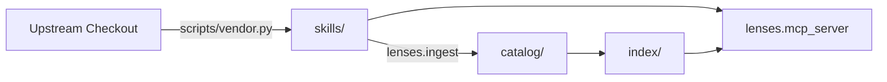

# superpowers-using-lenses


Agent skills are written whole and loaded whole. That is fine for a 200-line
lens and wasteful for a UI library's manual, where a slice about grids and
buttons needs two sections out of forty.

This cuts skills into **parts** — stretches usable on their own — and serves
them to an agent over MCP, so an architect designing a milestone, a slice spec
or a plan can find the two that bear on it and cite them, instead of pulling
whole skills into context.

Currently **41 skills · 405 parts** from four upstreams.

## The pipeline



Each stage writes what the next one reads, and each artefact says where it came
from. Nothing downstream ever reaches back to an upstream checkout.

## Two invariants

**The model marks up. It never writes.** Decomposition returns *line ranges*
and metadata; part text is then cut from the file by those ranges. What reaches
any downstream agent is verbatim upstream text. The model's only original
output is `title` and `applies_to`, which are metadata nobody executes.

This is structural rather than a rule to remember: there is no code path by
which generated prose becomes an instruction. It also settles the licence
question — this redistributes quotations with provenance — and it is why a
cheap decomposition model is a deliberate choice rather than a corner cut.

**The catalogue is source; the index is derived.** `skills/` and `catalog/`
live in git and are reviewable as diffs. `index/` is rebuilt from the catalogue
on every run and is gitignored. That direction is what lets a citation survive
a rebuild, and lets a contributor propose a change as a pull request rather
than as a row in somebody's database.

## Two ways in

Which one applies is decided by the skill's own shape, not by a flag.

| | **Decompose** | **Import** |
|---|---|---|
| When | `SKILL.md` *is* the content | `rules/` holds the content, `SKILL.md` is a contents page |
| Boundaries drawn by | a model, as line ranges | the upstream author, as files |
| `applies_to` from | the model | the file's own frontmatter |
| Cost | one paid call per skill | **zero** |
| Determinism | re-running moves part ids | byte-stable |

Import exists because some upstreams ship one rule per file. Decomposing those
would cut up a contents page, lose every rule, and charge for it. Of the 405
parts here, **108 arrived free** this way.

## What a part carries

```yaml
- id: circuit-breaker
  title: Circuit breaker
  applies_to: Use when a slice calls a dependency that can be slow or down.
  kind: lens                    # lens · reference · pipeline
  preamble_spans: [[3, 14]]     # parent context, quoted — without it the part misleads
  spans: [[128, 171]]           # the part itself
  requires: [timeouts]          # siblings that must travel with it
  tags: [resilience, timeouts]  # author's keywords, when the upstream gives them
  file: rules/circuit.md        # imported parts only; absent means spans cut SKILL.md
  sha256: a71c…                 # of preamble+text — the pin a citation carries
```

`preamble_spans` exists because a section torn from its definitions is not
merely incomplete, it can be actively wrong. `sha256` exists because a citation
by name alone starts meaning something else the day upstream is rewritten.

`requires` is the case a preamble cannot carry: not a heading but a whole
sibling section. `get_lenses` follows it — the full closure, not one hop — so a
part whose decomposition recorded that it cannot stand alone never arrives
alone. The extra parts come back in the same `parts` list, each naming what
pulled it in:

```json
{"ref": "…#configuration@…", "required_by": ["…#app-factory-lifespan@…"]}
```

A part you asked for has an empty `required_by`. Cite what you chose, not what
came with it. Nothing is dropped in silence: a requirement that will not
resolve, and a closure that outgrows the ceiling of 12 parts per reference,
are both named in `errors` while everything that did resolve is still returned.
`find_lenses` reports `requires` and does not follow it — a candidate is
something you are still deciding about, and expanding it there would spend your
`limit` on parts you never chose.

Measured over the catalogue as committed: 76 edges across 26 parts in 11 of 41
skills, no cycles at any length, widest closure 7 (at
`wondelai/pragmatic-programmer#common-pragmatic-mistakes`). The visited set is
not decoration — `decompose` rejects unknown ids and self-reference but not
`a → b → a`, so that zero is an observation about one model's output rather
than a property of the format.

## Setup

```bash
python -m venv .venv
.venv/Scripts/python -m pip install -e ".[dev]"
cp .env.example .env
```

Two OpenAI-compatible endpoints: a chat model for decomposition, an embedding
model for the index. They can be one server. `embedder_dim` is the vector
width, not the model's context length — `bge-base-en-v1.5` is 768 wide with a
512-token window, and the two are easy to confuse. It is asserted twice: against
the vectors the server returns, and against the index already on disk. Both
matter, because a query and an index built by different models score against
each other silently and answer with confident nonsense. Changing the embedder
means rebuilding the index — the catalogue is unaffected, being the model's
work rather than the embedder's.

A third model narrows the 20 dense candidates to the answer. `reranker_kind`
picks how:

| | `cross-encoder` (default) | `llm` |
|---|---|---|
| Sees | one candidate at a time | the whole numbered pool |
| Needs an endpoint | no — a local model name | yes, its own three settings |
| Need-only phrasing | 16/17 | 16/17 |
| **Project phrasing** | 14/17 | **16/17** |
| Cost | 0.09 s/query | 0.23 s/query |

The default is the one that asks nothing of you, not the one that scores best;
`.env.example` has the full table and the commented-out `llm` block. Its
endpoint is deliberately separate from `llm_base_url` — that model decomposes
skills once each, this one runs on every search and wants to be local.

`cross-encoder` takes a model **name**, not a URL: it reads a (query, passage)
pair in one forward pass and no OpenAI-compatible server exposes that. Pointing
`embedder_model` at a reranker is a trap worth naming — the server answers 200
with plausible-looking vectors, every dimension guard passes, and retrieval
quietly gets worse.

`sources.yaml` says which upstreams to vendor from and which of their skills to
take; `sources_root` in `.env` keeps the machine-specific part out of it.

## Commands

```bash
python scripts/vendor.py                     # upstream -> skills/
python scripts/vendor.py --check             # re-hash the corpus, report drift
python -m lenses.ingest --dry-run            # what would run, and in which mode
python -m lenses.ingest                      # skills/ -> catalog/ + index/
```

| Flag | |
|---|---|
| `--only LABEL` / `--skill NAME` | narrow to one upstream or one skill (glob) |
| `--dry-run` | list the plan; **calls nothing**, so it is safe as a cost check |
| `--force` | re-decompose what is already catalogued |
| `--limit N` / `--yes` | cap a run; `--yes` is required above 25 paid skills |
| `--no-embed` | catalogue only, skip the index |

A catalogue file is keyed by its source's content hash, so a second run over
unchanged skills does nothing. Not only a speed trick: decomposition is
non-deterministic, and re-deriving parts nobody asked to change would move
every part id and break every citation pinned to them.

## Serving it: MCP

```json
{
  "mcpServers": {
    "using-lenses": {
      "command": "<repo>/.venv/Scripts/python.exe",
      "args": ["-m", "lenses.mcp_server"],
      "env": { "LENSES_HOME": "<repo>" }
    }
  }
}
```

| Tool | |
|---|---|
| `find_lenses(intent, limit, kind, stack)` | ranked parts for a stated need |
| `get_lenses(refs)` | the text those references name, verified against its pin |
| `list_skills()` | what the corpus holds, before concluding it holds nothing |

State the **need**, not the solution, and strip the project it came from.
*"an external call in the request path can hang or be down and must not take
the whole service with it"* returns the right part first. Parts are indexed by
*when they apply*, so proper nouns — `Stripe`, `checkout`, the feature name —
pull the query toward parts that merely share their vocabulary.

How much that costs depends on `reranker_kind`: the `llm` pass reads past
project vocabulary almost completely, the `cross-encoder` pass does not. The
need-only habit is worth keeping because it is the form that works under
either. `ranked_by` in each response says which one answered.

Two operational facts. The index is read **once at startup** — rebuild the
corpus and the running server will not notice, so restart the client. And
`find_lenses` needs the embedding endpoint up; without it the tool returns a
readable error rather than silence.

## Citing a part

`find_lenses` returns references shaped like:

```
wondelai/release-it#stability-anti-patterns@34ac73394a51
```

Put those in a document's `lenses:` frontmatter. The trailing version is the
point — it pins the text, so the citation cannot come to mean something else
later. A session opening that document resolves them with `get_lenses`.

## Gates

Nothing is written that fails these. All mechanical, all offline.

*Decomposed:* spans inside the file, ordered, non-overlapping; coverage above
`min_coverage`, with the unclaimed line ranges printed; no single part larger
than both 100 lines and 35% of the document — that is the document, not a part
of it; `requires` resolving inside the same skill; ids unique and kebab-case.

*Imported:* every part names a file that exists and is non-empty, with an
`applies_to`. Coverage and overlap do not apply — those exist to catch a model
cutting one document badly, and here there was no cutting.

*Corpus:* `vendor.py --check` re-hashes every vendored byte, and `get_lenses`
re-checks a part's own hash before returning it. An edited quotation is refused
rather than served.

## What is not settled

Honest status, because the numbers are thin.

**`requires` is wired, but only 6.4% of the corpus writes it.** 26 parts of 405
carry the field, so following it changes what an agent receives for those 26
and nothing else. Half the corpus — 204 parts — carries neither `requires` nor
`preamble_spans`, which is to say nothing travels with it at all. Raising that
is a decompose-prompt change plus a paid re-ingest of every skill, and it is
worth paying for only now that something reads the result: `decompose.py` gives
`requires` one line where `kind` and `applies_to` each get a paragraph, which
is the likeliest reason for the 6.4%.

**A closure hands you the preamble once per part.** When siblings share a
`preamble_spans` prefix — 23 of the 26 closures do — each arrives carrying its
own copy, because each part's text is what its `sha256` covers. Across the
whole catalogue that is 23 236 duplicated characters of 231 413 returned: 10%,
rising to 24% on the worst closure. It is not deduplicated on purpose. Trimming
the repeat would return text that no longer matches the recorded hash, and a
citation that resolves to different text is the failure this design exists to
prevent. Ten percent buys every part in the answer being verifiable on its own.

**Nothing rejects a cycle at ingest.** `decompose` refuses unknown part ids and
self-reference, and stops there. Resolution carries a visited set so a cycle
terminates at runtime, but the catalogue would happily record one and no
validation would say so.

**The phrasing gap is mostly closed, and how it closed is the lesson.**
`scripts/eval_retrieval.py` runs seventeen needs in two registers: the need
alone, and the same need carrying a real project's proper nouns. Only the
second occurs in production. With a cross-encoder second pass those scored
16/17 and 14/17; with the `llm` pass, **16/17 and 16/17**.

Two stronger cross-encoders were tried first and both lost — `bge-reranker-base`
25/34, `bge-reranker-v2-m3` 29/34, against MiniLM's 30/34. The fix was never a
bigger model of the same shape. A cross-encoder compares two strings; it cannot
know that *"keeping a Stripe call from hanging"* is a resilience need. An
instruction-tuned model can, and one 0.23-second call does it.

The shape mattered more than the model. Asked to score candidates one at a time
with a digit, the same gemma scored 23/34; shown all twenty at once and asked
which six are best, 32/34. Small models have no stable absolute scale — *"is
this a 7 or an 8?"* — but comparison inside a visible set needs no scale.

What is still open: **n is 17 per axis**, so the margin that decided this is two
cases. The remaining failure (*proving the whole path works end to end*) is not
a ranking failure at all — the target sits at dense rank 33, outside the pool of
20, so no second pass can reach it. Widening the pool fixes recall and costs
more than it buys, which is its own entry below.

**A benchmark written in the corpus's own voice will report health it has not
measured.** Every number this project has ever quoted came from the `intent`
axis alone, which grades the corpus against queries drawn from its own
vocabulary — and it read 17/17 while a third of realistic phrasings were
failing. The `concrete` axis exists so that the next
change to ranking is measured against the register it will actually meet; only
the `intent` axis sets the exit code, deliberately, since a gate that is red on
arrival is one everybody learns to pass without reading.

**Lexical search lost, against expectation.** BM25 over `applies_to` was
supposed to be the cheap baseline; measured on the original four queries, it was
1 of 4 against dense's 3 of 4. Queries arrive as needs, and keywords cannot
bridge to solutions. It is worth noting BM25 would *not* rescue the phrasing
gap above: the proper nouns that break those queries — `Stripe`, `SendGrid`,
`eu-west` — appear nowhere in the corpus, so a lexical pass has nothing to
match them against either.

**`kind` is only as good as the model that assigned it.** A cheap model
inverted it — scoring rubrics labelled `lens`, the Dependency Rule labelled
`reference`. A frontier model got six of six right. Do not filter on this field
without knowing which model produced the entry; `decomposed_by` records it.

**`document_kinds` over-claims, so `list_skills` coverage reads high.** It
reports 17 skills bearing on a milestone brief — but `vite-patterns`,
`react-patterns`, `postgres-patterns` and `fastapi-patterns` are all among
them, and a milestone brief does not turn on a bundler's config. The
decomposition model appears to have answered "could this ever be relevant?"
rather than "does this belong at this altitude". Read that 17 as *declared*,
not *suitable*. This is why the field is reported and never filtered on: a
wrong label that narrows a search is worse than a wrong label you can see.

**The confidence gate was removed, and it had been costing us.** A reranked
ordering whose top logit fell below −8.0 used to be discarded for the dense one.
Measured across 34 queries it fired on ten and changed the outcome on four:
helping once, hurting three times. The signal was a category error — a
cross-encoder's logit says *"is this passage good for this query"*, absolute
relevance, and it was being read as *"is my ordering trustworthy"*. In the worst
case the reranker had the correct part at **rank 1** while scoring −10.0, and
the gate threw that ordering out for a dense one holding it at rank 10.

**The `llm` pass is deterministic, but only as measured.** Thirty-four queries
× three runs returned byte-identical orderings at `temperature=0`. That is one
LM Studio session; across restarts, model reloads or a different backend it is
untested. The pipeline it replaced was deterministic by construction, and this
one is deterministic by observation — not the same guarantee.

**The ranking prompt is a tuning surface with no unit test.** `build_prompt`
can be reworded and every test still passes; only the eval can tell whether a
wording is better. Change it and re-run that, never read it and agree. The
model also repeats a number in about one query in eight — harmless, because the
dense order backfills the position, but it is the model being sloppy rather
than the parser being clever.

**Pool width is a property of the reranker, not of the task.** MiniLM gets
worse with more candidates (30/34 at pool-20, 27/34 at pool-40) — it cannot
hold precision over the extra distractors. Both BGE rerankers get *better*.
Do not tune `CANDIDATE_POOL` without re-measuring the model underneath it.

**No cost accounting.** Runs have crossed three providers and three models and
there is not one token count in the catalogue.
